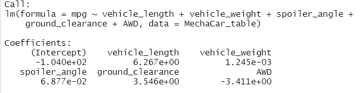
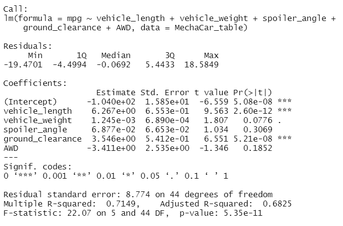
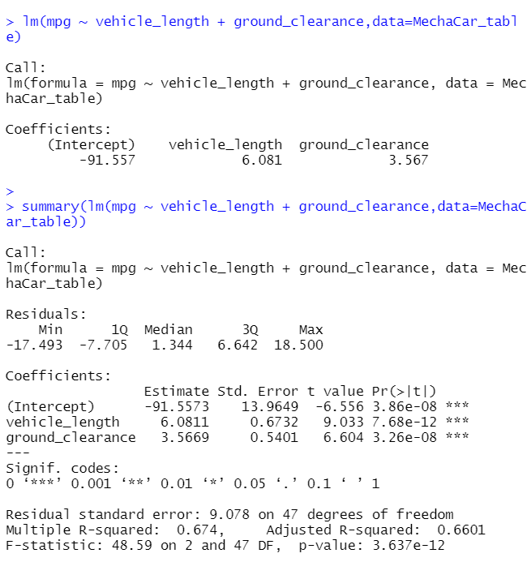
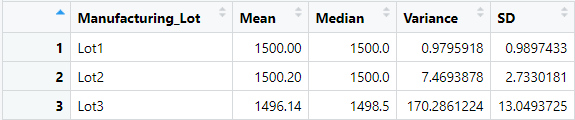
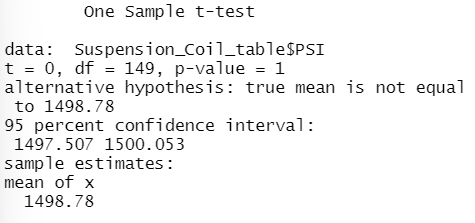
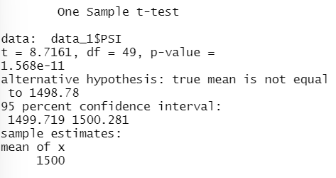
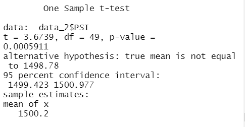
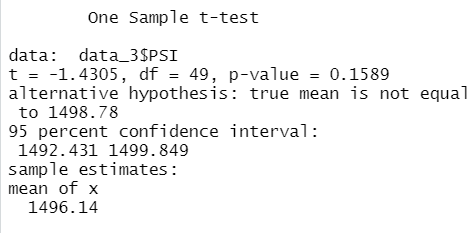

# MechaCar_Statistical_Analysis
## Overview of Project
•	MechaCar analysis project involves Perform multiple linear regression analysis to identify which variables in the dataset predict the mpg of MechaCar prototypes.
•	Collect summary statistics on the pounds per square inch (PSI) of the suspension coils from the manufacturing lots.
•	Run t-tests to determine if the manufacturing lots are statistically different from the mean population.
•	Design a statistical study to compare vehicle performance of the MechaCar vehicles against vehicles from other manufacturers. For each statistical analysis, you’ll write a summary interpretation of the findings.

## Analysis
## Linear Regression to Predict MPG

Residual Standard error: 8.774 on 44 degrees of freedom
Multiple R-squared: 0.7149, Adjusted R-squared:0.6825
F-statistic:22.07 on 5 and 44DF.  P-value: 5.35e-11

•	The variables vehicle length, ground clearance have non-random amount of variance to mpg values in dataset where as vehicle width also has significance but less than vehicle length and ground clearance. Spoiler angle and AWD have random amount of variance to mpg values in dataset.
•	p-value of our linear regression analysis is 5.35e-11, which is much smaller than our assumed significance level of 0.05%. There is sufficient evidence to reject our null hypothesis, which means that the slope of our linear model is not zero.
•	The linear model predicts mpg of MechaCar prototypes effectively as we can confirm by including only the vehicle length and ground clearance and doing linear regression. P-value changes but its still significant enough to show that our linear model helps predict mpg of MechaCar.

## Summary Statistics on Suspension Coils

•	The design specifications for the MechaCar suspension coils dictate that the variance of the suspension coils must not exceed 100 pounds per square inch.
•	The current manufacturing data meet this design specification for all manufacturing lots in total however when we look at the 3 lots individually it clearly shows that the lot 3 does not meet the design specification since the variance for lot 3 is 170.2861 which far exceeds the variance of 100 pounds per square inch.

## T-Tests on Suspension Coils

t-test results across all manufacturing lots has mean of x is 1498.78 t-test shows that for lot 3 mean of x is 1496.14 whereas lot 1 and lot 2 are 1500 and 1500.2 respectively.

## Study Design: MechaCar vs Competition

* We can use same parameters as used in the present analysis like vehicle length, ground clearance, spoiler angle, AWD for other manufacturers as its already proven from our linear regression model that vehicle length and ground clearance have significant impact on mpg which gives predicatability of the performance of cars.
* Null hypothesis: MechaCar has better performance than the vehicles from other manufacturers.  Alternate hypothesis:  MechaCar performance is not better than vehicles from other manufacturers.
* Linear Regression can be used to test our hypothesis for determining the performance of MechaCar vs other manufacturers.
